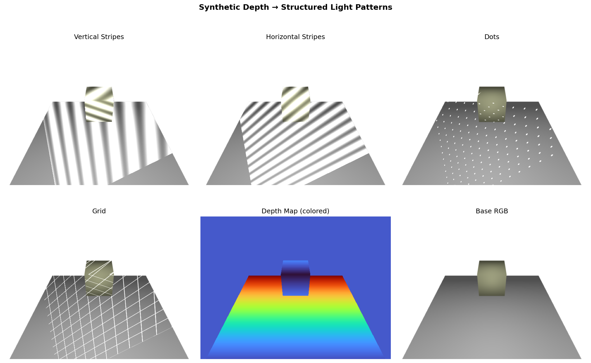

# Structured Light Generator

A Python tool for generating synthetic structured light patterns overlaid on images with depth data. This is designed for data augmentation to improve vision models for robotic grasping tasks.

## Three Approaches Available

### 1. Simple 2D Pattern Generator (`structured_light_generator.py`)
Quick depth-based pattern overlay for existing images.

### 2. Full 3D Simulator (`structured_light_3d.py`)
Realistic 3D scene rendering with projector and camera at different positions.

### 3. Depth-Map-Based Projector (`structured_light_from_depth.py`) **NEW!**
Decouple pattern projection from geometry - works with any depth map source!



## Overview

Structured light is a 3D scanning technique that projects known patterns onto objects and analyzes the deformation to extract depth information. This tool provides three ways to generate synthetic structured light training data:

1. **2D Pattern Generator**: Fast pattern overlay onto existing depth maps
2. **3D Simulator**: Full geometric simulation with configurable projector and camera positions
3. **Depth-Based Projector**: Pattern projection using only depth maps (works with real depth cameras!)

## Features

### Pattern Types

- **Sinusoidal Stripe Patterns**: Smooth vertical or horizontal fringes that deform based on depth
- **Binary Stripe Patterns**: Sharp black and white stripes with depth-based phase shifts
- **IR Dot Patterns**: Kinect-style infrared dot grids with depth displacement
- **Deformed Grid Patterns**: Regular grids warped by surface depth

### Capabilities

- **Depth-based Modulation**: All patterns react to depth maps, simulating real structured light behavior
- **Realistic Noise**: Adds Gaussian noise and missing data regions to simulate real sensor artifacts
- **RGB Overlay**: Blend patterns onto existing RGB images with configurable intensity
- **Cross-platform Display**: Automatically detects display availability
  - Shows interactive matplotlib window when display is available
  - Saves to timestamped PNG files when running headless (Linux servers, WSL, SSH sessions)
- **Output Management**: All visualizations saved to `output/` folder with timestamps

## Requirements

```bash
pip install -r requirements.txt
```

Or manually:
```bash
# For 2D pattern generator
pip install numpy opencv-python matplotlib pillow

# For 3D simulator (includes above)
pip install numpy opencv-python matplotlib pillow trimesh pyrender
```

## Usage

### Quick Start: 2D Pattern Generator

```bash
python structured_light_generator.py
```

This will:
1. Generate a synthetic depth map with random box-like structures
2. Create multiple structured light patterns
3. Display a 3×3 grid of visualizations (if display available)
4. Save the visualization to `output/structured_light_patterns_YYYYMMDD_HHMMSS.png`

### Quick Start: 3D Simulator

**Without config (uses defaults):**
```bash
python structured_light_3d.py
```

**With config file (recommended):**
```bash
python structured_light_3d.py config_example.yaml
```

This will:
1. Load configuration from YAML file (or use defaults)
2. Create projector at specified position
3. Build 3D scene with boxes at configured positions and orientations
4. Setup camera at specified viewpoint
5. Render the scene with multiple structured light patterns
6. Generate both RGB and depth images from camera viewpoint
7. Save visualizations to `output/structured_light_3d_*.png`

### Programmatic Usage: 2D Pattern Generator

```python
from structured_light_generator import StructuredLightGenerator
import numpy as np

# Initialize generator
generator = StructuredLightGenerator(image_size=(640, 480))

# Load your depth map (or create synthetic one)
depth_map = np.load('your_depth_map.npy')

# Generate patterns
vertical_stripes = generator.create_stripe_pattern(
    depth_map,
    frequency=20.0,
    orientation='vertical'
)

dot_pattern = generator.create_dot_pattern(
    depth_map,
    dot_spacing=30,
    dot_size=3
)

# Add realistic noise
noisy_pattern = generator.add_realistic_noise(
    vertical_stripes,
    noise_level=0.05,
    missing_regions=True
)

# Overlay on RGB image
rgb_image = cv2.imread('your_image.jpg')
result = generator.overlay_on_rgb(rgb_image, vertical_stripes, blend_factor=0.3)
```

### Programmatic Usage: 3D Simulator

```python
from structured_light_3d import (
    StructuredLightProjector,
    Scene3D,
    StructuredLightRenderer
)
import numpy as np

# Create projector at custom position
projector = StructuredLightProjector(
    position=np.array([0.5, -0.8, 1.5]),
    look_at=np.array([0.0, 0.0, 0.0]),
    fov=50.0,
    resolution=(1024, 768)
)

# Build 3D scene
scene = Scene3D()
scene.add_ground_plane(size=3.0, height=-0.5)
scene.add_box(
    size=(0.2, 0.3, 0.15),
    position=np.array([0.0, 0.0, 0.1])
)
# Or generate random boxes
scene.generate_random_boxes(num_boxes=5, bounds=(1.0, 1.0, 0.4))

# Setup renderer with camera
renderer = StructuredLightRenderer(
    projector=projector,
    camera_position=np.array([1.2, 0.0, 1.0]),
    camera_look_at=np.array([0.0, 0.0, 0.0]),
    camera_resolution=(640, 480),
    camera_fov=60.0
)

# Generate pattern and render
pattern = projector.create_stripe_pattern(frequency=15, orientation='vertical')
rgb_image, depth_map = renderer.render(
    scene,
    pattern,
    ambient_light=0.3,
    pattern_intensity=0.6
)

# rgb_image and depth_map are now ready to use for training
```

### Quick Start: Depth-Based Projector

**Generate depth from config geometry:**
```bash
python run_depth_based.py config_example.yaml
```

**Use external depth map (numpy):**
```bash
python run_depth_based.py config_example.yaml --depth my_depth.npy
```

**Use external depth map (PNG with scaling):**
```bash
python run_depth_based.py config_example.yaml --depth my_depth.png --max-depth 5.0
```

**With default config:**
```bash
python run_depth_based.py
```

**Get help:**
```bash
python run_depth_based.py --help
```

**Run examples:**
```bash
python example_depth_based.py
```

The main script will:
1. Load configuration from YAML file
2. Load external depth map OR generate from scene geometry
3. Project all configured patterns (respects `display: true/false`)
4. Save individual patterns and comparison visualization

The example script will run three demos:
1. Generate depth from geometry and project patterns
2. Load external depth map and project patterns
3. Compare depth quality (synthetic, noisy, filtered)

### Programmatic Usage: Depth-Based Projector

**Option A: Generate synthetic depth from geometry**

```python
from structured_light_from_depth import (
    CameraCalibration,
    ProjectorCalibration,
    DepthMapGenerator,
    PatternProjector,
    create_stripe_pattern
)
from structured_light_3d import Scene3D
import numpy as np

# Define camera calibration
camera_calib = CameraCalibration(
    position=np.array([1.2, 0.0, 1.0]),
    look_at=np.array([0.0, 0.0, 0.0]),
    fov=60.0,
    resolution=(640, 480)
)

# Define projector calibration
projector_calib = ProjectorCalibration(
    position=np.array([0.5, -0.8, 1.5]),
    look_at=np.array([0.0, 0.0, 0.0]),
    fov=50.0,
    resolution=(1024, 768)
)

# Generate depth from geometry (only needed for synthetic data)
scene = Scene3D()
scene.add_ground_plane()
scene.add_box(size=(0.3, 0.3, 0.3), position=np.array([0, 0, 0.15]))

depth_generator = DepthMapGenerator(camera_calib)
rgb_base, depth_map = depth_generator.render_depth(scene)

# Project pattern (no geometry needed!)
pattern_projector = PatternProjector(camera_calib, projector_calib)
pattern = create_stripe_pattern(projector_calib.resolution, frequency=15)
result = pattern_projector.project_pattern_backward(pattern, depth_map, rgb_base)
```

**Option B: Use external depth from real depth camera**

```python
from structured_light_from_depth import (
    CameraCalibration,
    ProjectorCalibration,
    PatternProjector,
    DepthMapIO,
    create_stripe_pattern
)

# Load depth from RealSense, Kinect, etc.
depth_map = DepthMapIO.load_depth_png('path/to/depth.png', max_depth=5.0)
# Or: depth_map = DepthMapIO.load_depth_npy('path/to/depth.npy')

# Define calibrations (must match your hardware!)
camera_calib = CameraCalibration(
    position=np.array([1.2, 0.0, 1.0]),
    look_at=np.array([0.0, 0.0, 0.0]),
    fov=60.0,
    resolution=(640, 480)
)

projector_calib = ProjectorCalibration(
    position=np.array([0.5, -0.8, 1.5]),
    look_at=np.array([0.0, 0.0, 0.0]),
    fov=50.0,
    resolution=(1024, 768)
)

# Project pattern onto depth (no geometry needed!)
pattern_projector = PatternProjector(camera_calib, projector_calib)
pattern = create_stripe_pattern(projector_calib.resolution, frequency=15)
result = pattern_projector.project_pattern_backward(pattern, depth_map)
```

### Depth Map I/O

The system supports two formats for external depth maps:

#### 16-bit PNG Format (Recommended for compatibility)

```python
from structured_light_from_depth import DepthMapIO

# Save depth as 16-bit PNG
# depth_map should be in meters (float array)
DepthMapIO.save_depth_png(depth_map, 'output/depth.png', max_depth=5.0)

# Load depth from PNG
# Returns depth in meters (float array)
depth_map = DepthMapIO.load_depth_png('output/depth.png', max_depth=5.0)
```

**Properties:**
- Format: Grayscale PNG, 16-bit unsigned integer
- Scaling: 0 → 0 meters, 65535 → max_depth meters
- Good for sharing with other tools and visualization

#### Numpy Array Format (.npy)

```python
# Save depth as numpy array
# No scaling - preserves exact values in meters
DepthMapIO.save_depth_npy(depth_map, 'output/depth.npy')

# Load depth from numpy array
depth_map = DepthMapIO.load_depth_npy('output/depth.npy')
```

**Properties:**
- Format: Raw numpy array (float32 or float64)
- No scaling - exact precision preserved
- Best for Python-only workflows

#### Depth Map Requirements

External depth maps must have these properties:

- **Shape**: (height, width) - 2D array matching camera resolution
- **Units**: Meters (distance from camera)
- **Values**:
  - 0 or negative = invalid/no depth
  - Positive = valid depth in meters
- **Data type**: float32 or float64

#### Visualization

```python
# Create color-coded visualization of depth
depth_colored = DepthMapIO.visualize_depth(depth_map)
```

#### Example: Using Intel RealSense

```python
import pyrealsense2 as rs
import numpy as np
from structured_light_from_depth import (
    CameraCalibration, ProjectorCalibration,
    PatternProjector, DepthMapIO, create_stripe_pattern
)

# Get depth from RealSense
pipeline = rs.pipeline()
config = rs.config()
config.enable_stream(rs.stream.depth, 640, 480, rs.format.z16, 30)
pipeline.start(config)

frames = pipeline.wait_for_frames()
depth_frame = frames.get_depth_frame()
depth_map = np.asanyarray(depth_frame.get_data()).astype(np.float32)

# RealSense depth is in millimeters, convert to meters
depth_map = depth_map / 1000.0

# Save for later use
DepthMapIO.save_depth_npy(depth_map, 'realsense_depth.npy')

# Define calibrations (must match your hardware setup!)
camera_calib = CameraCalibration(
    position=np.array([1.2, 0.0, 1.0]),
    look_at=np.array([0.0, 0.0, 0.0]),
    fov=60.0,
    resolution=(640, 480)
)

projector_calib = ProjectorCalibration(
    position=np.array([0.5, -0.8, 1.5]),
    look_at=np.array([0.0, 0.0, 0.0]),
    fov=50.0,
    resolution=(1024, 768)
)

# Project pattern onto real depth data
pattern_projector = PatternProjector(camera_calib, projector_calib)
pattern = create_stripe_pattern(projector_calib.resolution, frequency=15)
result = pattern_projector.project_pattern_backward(pattern, depth_map)
```

#### Format Comparison

| Format | Best For |
|--------|----------|
| **16-bit PNG** | Sharing with other tools, visualization, storage efficiency |
| **Numpy .npy** | Python-only workflow, exact precision, frequent loading/saving |

### When to Use Each Approach

| Approach | Best For |
|----------|----------|
| **2D Pattern Generator** | Quick prototyping, simple overlays, existing depth data |
| **3D Simulator** | Full control over geometry, testing different scenes, ground truth data |
| **Depth-Based Projector** | Real depth camera data, RealSense/Kinect integration, no geometry knowledge |

## Configuration File (3D Simulator)

The 3D simulator supports comprehensive YAML configuration for all parameters. See `config_example.yaml` for a full example.

### Configuration Structure

```yaml
# Projector position and settings
projector:
  position: [x, y, z]        # 3D position in meters
  look_at: [x, y, z]         # Point to aim at
  fov: 50.0                  # Field of view in degrees
  resolution: [1024, 768]    # Pattern resolution

# Camera position and settings
camera:
  position: [x, y, z]        # 3D position in meters
  look_at: [x, y, z]         # Point to aim at
  fov: 60.0                  # Field of view in degrees
  resolution: [640, 480]     # Image resolution

# Scene configuration
scene:
  ground_plane:
    enabled: true
    size: 3.0                # Size in meters
    height: -0.5             # Z-coordinate
    color: [200, 200, 200]   # RGB color

  # Manual box placement with precise control
  boxes:
    - size: [0.25, 0.25, 0.25]              # [width, depth, height]
      position: [0.1, 0.1, 0.125]           # [x, y, z] center
      orientation: [0.0, 0.0, 45.0]         # [roll, pitch, yaw] degrees
      color: [150, 100, 100]                # RGB or null for random

  # Random box generation (optional)
  random_boxes:
    enabled: false
    count: 5
    size_range:
      min: [0.10, 0.10, 0.10]
      max: [0.30, 0.30, 0.30]
    position_bounds:
      x: [-0.5, 0.5]
      y: [-0.5, 0.5]
      z: [0.0, 0.4]
    orientation_range:
      roll: [0.0, 360.0]
      pitch: [0.0, 360.0]
      yaw: [0.0, 360.0]

# Pattern types to generate
patterns:
  - type: "vertical_stripes"
    frequency: 15.0
    pattern_type: "sinusoidal"  # or "binary"
  - type: "dots"
    dot_spacing: 40
    dot_size: 4

# Rendering parameters
rendering:
  ambient_light: 0.3
  pattern_intensity: 0.6

# Output settings
output:
  directory: "output"
  prefix: "structured_light_3d"
  save_individual_patterns: true
  save_comparison: true
```

### Key Features:

- **Projector & Camera**: Full 3D positioning with look-at targets
- **Box Placement**: Precise control over position and orientation (roll, pitch, yaw)
- **Euler Angles**: Intuitive rotation specification in degrees
- **Random Generation**: Optional random box placement with configurable ranges
- **Pattern Control**: Configure which patterns to generate and their parameters
- **Output Control**: Customize output directory, filename prefix, and what to save

## Output

The script generates a 3×3 visualization grid showing:

### Row 1: Stripe Patterns
- Vertical sinusoidal stripes
- Horizontal sinusoidal stripes
- Binary stripes

### Row 2: Special Patterns
- IR dot pattern (Kinect-style)
- Deformed grid pattern
- Noisy pattern with missing regions

### Row 3: Context and Overlays
- Input depth map
- RGB + stripe pattern overlay
- RGB + dot pattern overlay

## Display Behavior

The script automatically detects whether a display is available:

- **With Display** (Mac, Linux desktop with X11): Opens interactive matplotlib window AND saves file
- **Without Display** (headless servers, SSH, WSL): Saves timestamped PNG to `output/` folder
- All output files are saved with timestamps like: `structured_light_patterns_20251022_083755.png`

## Use Cases

- **Data Augmentation**: Expand training datasets for depth-sensing neural networks
- **Sim-to-Real Transfer**: Train models on synthetic structured light before deploying to real sensors
- **Algorithm Testing**: Test structured light processing algorithms without hardware
- **Educational**: Understand how different structured light techniques work

## Customization

Adjust pattern parameters to match your specific needs:

```python
# Denser stripes
pattern = generator.create_stripe_pattern(depth_map, frequency=40.0)

# Larger dots
dots = generator.create_dot_pattern(depth_map, dot_spacing=50, dot_size=5)

# More realistic noise
noisy = generator.add_realistic_noise(pattern, noise_level=0.1, missing_regions=True)

# Stronger overlay
blended = generator.overlay_on_rgb(rgb, pattern, blend_factor=0.5)
```

## Next Steps

1. Load your actual depth maps and RGB images
2. Experiment with different pattern parameters
3. Save patterns as additional training channels
4. Integrate into your data pipeline

## License

MIT License - feel free to use in your projects!
